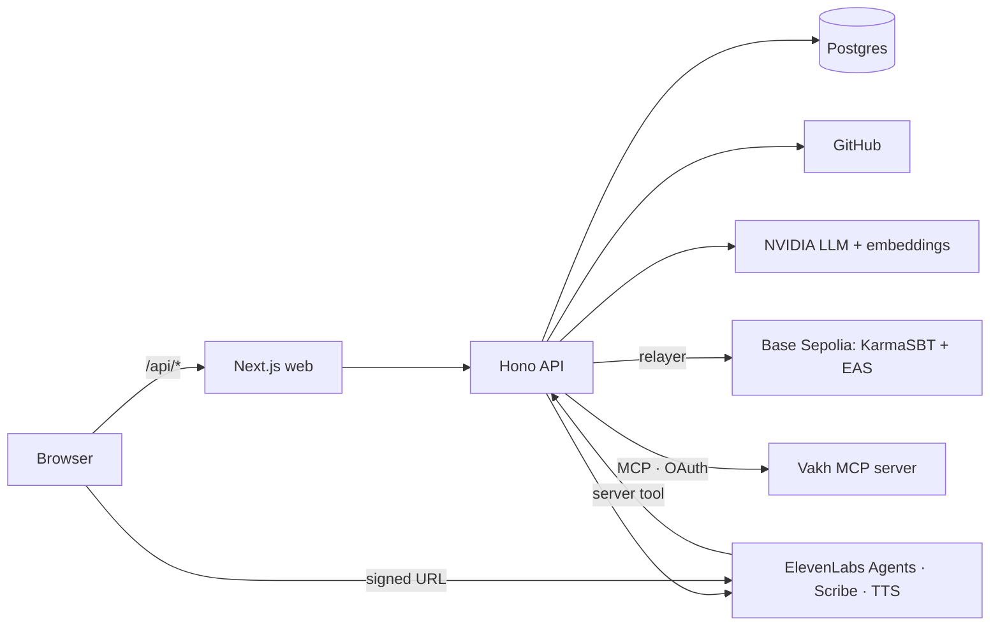

<div align="center">

<br/>

# ⛓️ KarmaChain

### Verified work → soulbound proof → recruiter match → voice interview

<p align="center">
  
  
  
  
</p>

<p align="center">
  
  
  
  
  
  
  
  
  
  
  
  
  
</p>

<p align="center">
  <a href="https://karmachain.up.railway.app"><strong>🌐 Live App</strong></a> ·
  <a href="https://karmachain.up.railway.app/demo"><strong>🎬 Guided Demo</strong></a> ·
  <a href="https://vakh.com/form/1f5f244c-9fda-4baa-9392-9c62afdc072e"><strong>📇 Vakh Directory</strong></a> ·
  <a href="https://api-production-a5e7.up.railway.app/health"><strong>💚 Health Check</strong></a>
</p>

</div>

---

## 📚 Table of Contents

- [What it does](#-what-it-does)
- [Feature Matrix](#-feature-matrix)
- [System Architecture](#️-system-architecture)
- [Scoring & AI Pipeline](#-scoring--ai-pipeline)
- [Vakh — MCP Integration](#-vakh--mcp-integration)
- [Voice (ElevenLabs)](#️-voice-elevenlabs)
- [Smart Contracts](#-smart-contracts)
- [Project Structure](#️-project-structure)
- [Quick Start](#-quick-start)
- [Environment Variables](#️-environment-variables)
- [Pages & Routes](#-pages--routes)
- [Deploy (Railway)](#-deploy-railway)
- [Security](#-security)
- [Honest Limitations](#️-honest-limitations)
- [Fairness & Ethics](#️-fairness--ethics)

---

## 💡 What it does

**Proof → Profile → Match → Interview**

| Step | What happens |
|---|---|
| **1. Proof** | Sign in with GitHub (read-only, public data). The API scores each language from repos and merged PRs: 90 points of deterministic signals plus at most 10 from a bounded LLM rubric. The tier (**Basic / Medium / Top**) is minted as a **soulbound token (ERC-5192)** carrying the hash of its evidence. |
| **2. Profile** | A public page reads tokens from Base Sepolia and client or interview attestations from **EAS**, and rehashes the evidence in your browser. |
| **3. Match** | A recruiter chats with **Karma**, which builds a structured job spec and ranks opted-in candidates with reasons that cite evidence. |
| **4. Interview** | An **ElevenLabs voice agent** runs a short interview from that spec. The report scores four criteria, each backed by verbatim transcript quotes. The candidate can anchor the report hash on-chain. |
| **5. Share** | Minted proofs appear in a public **Vakh** directory, and recruiters push shortlists to a pipeline board in their own Vakh, all over **MCP**. |

---

## ✨ Feature Matrix

| Area | Feature | Status |
|---|---|---|
| **Proof** | GitHub OAuth (`read:user` only) | ✅ |
| | Deterministic signals: merged external PRs (star-weighted), tests, CI, activity, account age | ✅ |
| | Bounded LLM code-substance rubric (max 10 / 100, zod-validated) | ✅ |
| | Evidence JSON + `keccak256` hash, publicly re-verifiable at `/evidence/<hash>` | ✅ |
| | Portfolio import (ownership-verified) and zip upload (self-declared, never minted) | ✅ |
| **Chain** | ERC-5192 soulbound token, one per (owner, skill), tier upgradeable | ✅ |
| | Gasless mint via backend relayer, gas-price cap | ✅ |
| | Admin revocation with public on-chain reason | ✅ |
| | EAS client reviews (delegated, wallet-signed) and interview-result attestations | ✅ |
| **Recruiter** | Conversational intake → structured `JobSpec` | ✅ |
| | Embedding + tier-fit + external-validation ranking, evidence-cited reasons | ✅ |
| | Interviewer style from the recruiter's own messages (persona, not voice cloning) | ✅ |
| **Voice** | Live ElevenLabs interview agent, evidence-quoted report | ✅ |
| | Karma Verify ("is this developer legit?") over on-chain data | ✅ |
| | Voice-signed testimonial (Scribe → structured → EAS) | ✅ |
| **Vakh** | Public "Verified Developers" directory (feed · table · board · dashboard) | ✅ |
| | Recruiter pipeline board with cross-form proof references | ✅ |
| | Auto-archive on revoke, opt-out or account deletion | ✅ |
| | Vakh board stage → AI interview → report written back to the card | ✅ |
| **Social** | Proof feed with wallet-signed, tier-weighted endorsements | ✅ |

---

## 🏗️ System Architecture



### Key Design Decisions

| Decision | Why |
|---|---|
| Web proxies `/api/*` to the API | First-party cookies, no CORS, secrets never in the browser |
| Soulbound (ERC-5192), one token per skill | Stops buying or transferring reputation; tier can be upgraded, never downgraded by a re-run |
| Evidence hash on-chain, evidence JSON off-chain | Anyone can rehash and compare; no IPFS dependency |
| LLM capped at 10 of 100 points | Deterministic signals dominate; LLM output is zod-validated and never decides security alone |
| Cosine in TypeScript over jsonb vectors | No pgvector needed for the demo scale |
| Vakh via MCP, not a bespoke API | The same structured data people browse is readable by any assistant |

More: [`docs/ARCHITECTURE.md`](docs/ARCHITECTURE.md) · every external fact is sourced in [`docs/VERIFIED.md`](docs/VERIFIED.md).

---

## 🧠 Scoring & AI Pipeline

```
GitHub repos + merged PRs
        │
        ▼
Deterministic signals (90 pts) ──┐
                                 ├──► score 0-100 ──► tier gates ──► Basic / Medium / Top
Bounded LLM rubric (≤10 pts) ────┘                                     │
                                                                       ▼
                                                     evidence JSON ──► keccak256 ──► KarmaSBT mint
```

| Stage | Model / method |
|---|---|
| Code substance rubric | NVIDIA NIM chat model (env-configured), strict JSON, zod |
| Recruiter intake | Tool calling with JSON-only fallback |
| Matching | `0.5 · cosine + 0.3 · tierFit + 0.2 · externalValidation` |
| Match reasons | LLM must cite evidence keys; template fallback |
| Interview report | Four criteria, each with verbatim transcript quotes |

---

## 🔌 Vakh — MCP Integration

KarmaChain is an **MCP client** of [Vakh](https://vakh.com) (`https://xo.vakh.com/mcp`, Streamable HTTP, OAuth 2.1 with dynamic client registration + PKCE). No Vakh credential ever reaches the browser.

| Flow | Account | MCP tools | Trigger |
|---|---|---|---|
| **Public proof directory** — "KarmaChain · Verified Developers" with Latest, Directory, By-tier and Stats views | KarmaChain studio | `get_form` · `create_form` · `update_form` · `create_post` | Mint by an opted-in developer, opt-in, or admin backfill |
| **Revocation & opt-out** — post archived (reversible) | KarmaChain studio | `archive_post` | Admin revoke, opt-out, account deletion |
| **Recruiter pipeline** — Shortlisted → Contacted → Interviewing → Offer / Passed, each card linked to public proof posts | Recruiter's own Vakh | `create_form` · `query_view` · `create_post` (with `reference`) | "Send shortlist to Vakh" on `/recruiter` |
| **Board drives interviews** — move a card to Interviewing in Vakh → KarmaChain creates the AI voice interview and writes the link back; the report and score follow when it's scored | Recruiter's own Vakh | `query_view` · `update_post` | Background sync (2 min) + **Sync** on `/recruiter` |

- Rotating refresh tokens stored AES-GCM encrypted, refreshes serialised per account
- 20 s timeouts, retry on network / 5xx, one forced-refresh retry on 401
- Publishing never blocks a mint; idempotent via `analyses.vakh_post_id` and `query_view` dedupe
- Post text built only from stored evidence — no LLM, nothing invented

Setup and details: [`docs/VAKH.md`](docs/VAKH.md).

---

## 🎙️ Voice (ElevenLabs)

| Feature | ElevenLabs product |
|---|---|
| Karma Interviewer — live voice interview from the JobSpec | Agents (signed URL) |
| Karma Verify — "is this developer legit?" | Agents + server tool |
| Voice-signed testimonial | Scribe (speech-to-text) |
| Profile briefing | Text-to-speech |

Exactly where and how: [`docs/ELEVENLABS_SETUP.md`](docs/ELEVENLABS_SETUP.md).

---

## 📜 Smart Contracts

**Base Sepolia (chainId 84532)**

| Contract | Address |
|---|---|
| KarmaSBT | `0x42dd54F23A31AA40634c428999AaB584d04cf3D1` |
| EAS (predeploy) | `0x4200000000000000000000000000000000000021` |
| SchemaRegistry (predeploy) | `0x4200000000000000000000000000000000000020` |
| Schema `ClientReview` | `address developer, uint8 rating, string skillTag, string summary, bytes32 transcriptHash` |
| Schema `InterviewResult` | `address candidate, bytes32 reportHash, uint8 overall, string role` |

---

## 🗂️ Project Structure

```
karmachain/
├── apps/
│   ├── web/                 # Next.js 16 App Router, Tailwind v4, wagmi, RainbowKit, @elevenlabs/react
│   │   └── src/app/         # /, /dashboard, /u/[handle], /recruiter, /interview, /feed, /admin, /evidence
│   └── api/                 # Hono + zod + Drizzle (Postgres / PGlite), viem
│       └── src/
│           ├── analysis/    # GitHub signals, LLM rubric, scoring, evidence
│           ├── chain/       # mint, reader, EAS
│           ├── recruiter/   # intake, embeddings, matching
│           ├── voice/       # ElevenLabs sessions, evaluation, server tools
│           ├── vakh/        # MCP client, OAuth, forms, publishing
│           └── routes/      # HTTP routes
├── packages/
│   ├── contracts/           # KarmaSBT.sol (ERC-721 + ERC-5192 + AccessControl), Foundry
│   └── shared/              # zod schemas, rubric, ABI, deployments
└── docs/                    # ARCHITECTURE, DEMO, VERIFIED, ELEVENLABS_SETUP, VAKH, design/
```

---

## 🚀 Quick Start

### Prerequisites

Node 20+ (22 recommended) · pnpm 10 · Foundry (`curl -L https://foundry.paradigm.xyz | bash && foundryup`)

```bash
# 1. Clone
git clone https://github.com/bastitva0-blip/karmachain.git && cd karmachain

# 2. Install & configure
pnpm install
cp .env.example .env         # fill what you have; everything else degrades gracefully

# 3. Run
pnpm dev                     # web → http://localhost:3000   api → http://localhost:8787
pnpm seed                    # 10 labelled demo profiles
```

Without `DATABASE_URL` the API uses an embedded PGlite database in `apps/api/.data/`. Without NVIDIA or ElevenLabs keys, the app falls back to templates and browser speech.

### Contracts

```bash
pnpm --filter contracts test
pnpm --filter contracts deploy            # writes packages/shared/deployments.json
pnpm --filter contracts register-schemas  # idempotent
pnpm --filter contracts demo:soulbound    # mint + a transfer that reverts on-chain
```

### Tests

```bash
pnpm test                 # api (vitest) + contracts (forge)
pnpm typecheck && pnpm lint
```

---

## ⚙️ Environment Variables

All variables are in [`.env.example`](.env.example). Secrets belong to the **api** service only.

| Group | Variables |
|---|---|
| Core | `WEB_ORIGIN`, `DATABASE_URL`, `SESSION_SECRET` |
| GitHub | `GITHUB_CLIENT_ID`, `GITHUB_CLIENT_SECRET`, `GITHUB_CALLBACK_URL` |
| AI | `NVIDIA_API_KEY`, `NVIDIA_LLM_MODEL`, `NVIDIA_EMBED_MODEL` |
| Voice | `ELEVENLABS_API_KEY`, `ELEVENLABS_INTERVIEW_AGENT_ID`, `ELEVENLABS_VERIFY_AGENT_ID`, `ELEVENLABS_TOOL_SECRET` |
| Chain | `RPC_URL`, `RELAYER_PRIVATE_KEY`, `SBT_ADDRESS`, `EAS_SCHEMA_*`, `MAX_GAS_PRICE_GWEI` |
| Vakh | `VAKH_MCP_URL`, `VAKH_APP_URL`, `VAKH_CALLBACK_URL`, `VAKH_DIRECTORY_FORM_ID`, `VAKH_SYNC_INTERVAL_SEC` (no API key — OAuth) |
| Web | `NEXT_PUBLIC_API_BASE`, `NEXT_PUBLIC_CHAIN_ID`, `API_INTERNAL_URL` (build + runtime) |

---

## 🌐 Pages & Routes

| Route | Purpose |
|---|---|
| `/` | Landing |
| `/demo` | Guided demo |
| `/dashboard` | Analyse, mint, consent, delete data |
| `/u/[handle]` | Public profile: tokens, attestations, evidence, Vakh links |
| `/evidence`, `/evidence/[hash]` | Rehash and verify any evidence |
| `/recruiter` | Karma chat, matches, interview launch, send to Vakh |
| `/recruiter/interviews` | This browser's interviews |
| `/interview/[id]`, `/interview/[id]/report` | Voice interview and report |
| `/feed` | Proof feed with signed endorsements |
| `/review/[handle]` | Client review / voice testimonial |
| `/admin` | Flags, revocations, relayer health, Vakh directory |

---

## ☁️ Deploy (Railway)

One project, two services from this repo (root directory `/`):

| Service | Config | Notes |
|---|---|---|
| api | `apps/api/railway.json` | All API env vars. Health check `/health?deep=0`. |
| web | `apps/web/railway.json` | `API_INTERNAL_URL` = API private URL **at build and runtime** (Next resolves rewrites at build time). |

Set `WEB_ORIGIN`, `GITHUB_CALLBACK_URL` and `VAKH_CALLBACK_URL` on the API to the public web domain.

---

## 🔒 Security

- [x] No secret in the client bundle (only `NEXT_PUBLIC_*`)
- [x] Relayer key is a throwaway testnet key; admin is a different wallet
- [x] httpOnly + SameSite=Lax session cookie; OAuth `state` validated; GitHub and Vakh tokens AES-256-GCM at rest
- [x] Single-use wallet nonces, 5-minute expiry
- [x] zod on every route; 1 MB default body cap
- [x] Rate limits on auth, analysis, mint, LLM, voice, upload and Vakh endpoints
- [x] SSRF guard and zip limits, both tested
- [x] LLM output never triggers a transaction without server-side checks
- [x] Only MINTER (relayer) can mint; admin ≠ relayer

---

## ⚠️ Honest Limitations

- **Testnet only.** Base Sepolia with faucet ETH.
- **Soulbound stops buying reputation, not farming it.** Mitigated with merged-PR weighting, activity and account-age gates, a capped LLM rubric, admin revocation and wallet-signed attestations.
- **Verified vs self-declared.** GitHub and ownership-verified portfolios can be minted; zip uploads are self-declared, capped at Medium and never minted.
- **Seeded data** is always labelled "Demo profile" (`demo-` handles).
- **AI is decision support.** Reports carry "A human must make the hiring decision."
- **Interview links are capability URLs.** Share them only with the people involved.

---

## ⚖️ Fairness & Ethics

- Discovery is opt-in (off by default); opting out also archives Vakh directory posts
- Explicit recording consent before every interview
- No automated rejection, no accent / voice-tone / personality scoring
- Soft skills appear only as quoted evidence

---

<div align="center">

**Roadmap:** more signal sources (package registries, code review), freelance platform imports, mainnet with DAO-managed revocation.

Built with ❤️ for CodeBlitz 2.0

</div>
