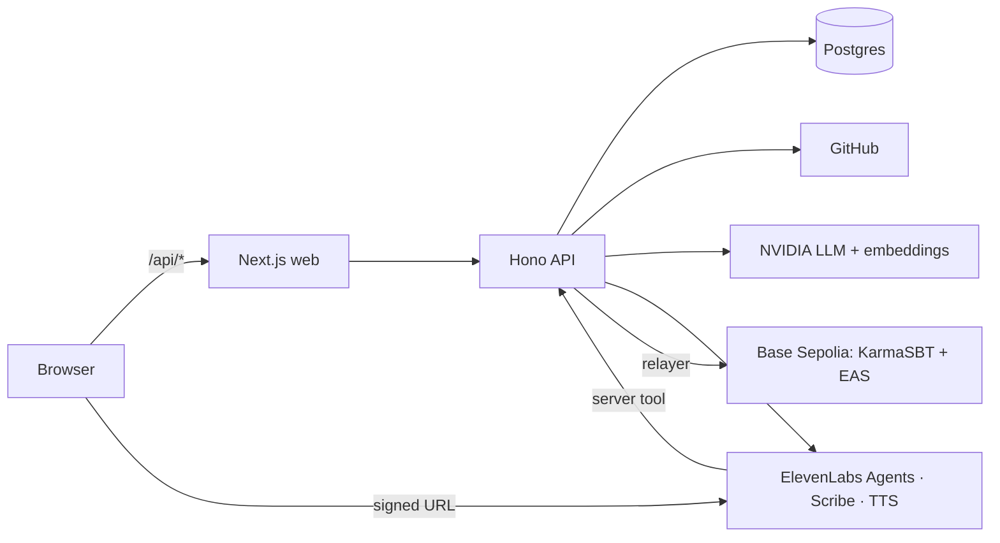

# KarmaChain

**Verified real-world work becomes portable, non-transferable proof. Recruiters find and voice-interview people on that proof.**

Proof → Profile → Match → Interview

1. **Proof.** Sign in with GitHub (read-only, public data). The API scores each language from repos and merged PRs: 90 points of deterministic signals plus at most 10 from a bounded LLM rubric. The tier (Basic / Medium / Top) is minted as a **soulbound token (ERC-5192)** carrying the hash of its evidence.
2. **Profile.** A public page reads tokens from Base Sepolia and client or interview attestations from **EAS**, and rehashes the evidence in your browser.
3. **Match.** A recruiter chats with Karma, which builds a structured job spec and ranks opted-in candidates with reasons that cite evidence.
4. **Interview.** An **ElevenLabs voice agent** runs a short interview from that spec. The report scores four criteria, each backed by verbatim transcript quotes. The candidate can anchor the report hash on-chain.

Built for CodeBlitz 2.0 (6-hour hackathon) and the ElevenLabs voice track. See [`docs/ELEVENLABS_SETUP.md`](docs/ELEVENLABS_SETUP.md) for exactly where ElevenLabs is used.

## Architecture



Details and design decisions: [`docs/ARCHITECTURE.md`](docs/ARCHITECTURE.md). Demo script: [`docs/DEMO.md`](docs/DEMO.md). Every external fact we rely on is sourced in [`docs/VERIFIED.md`](docs/VERIFIED.md).

| Package | What |
|---|---|
| `apps/web` | Next.js 16 App Router, Tailwind v4, shadcn-style UI, Motion, wagmi, RainbowKit, `@elevenlabs/react` |
| `apps/api` | Node 22, Hono, zod, Drizzle (Postgres, or embedded PGlite locally), viem, OpenAI client pointed at NVIDIA |
| `packages/contracts` | `KarmaSBT.sol` (ERC-721 + ERC-5192 + AccessControl), Foundry tests and scripts |
| `packages/shared` | zod schemas, scoring rubric, ABI, deployment addresses |

## Contracts (Base Sepolia, chainId 84532)

| Contract | Address |
|---|---|
| KarmaSBT | see `packages/shared/deployments.json` → `sbt` (Basescan: `https://sepolia.basescan.org/address/<sbt>`) |
| EAS (predeploy) | `0x4200000000000000000000000000000000000021` |
| SchemaRegistry (predeploy) | `0x4200000000000000000000000000000000000020` |
| Schema `ClientReview` | `address developer, uint8 rating, string skillTag, string summary, bytes32 transcriptHash` |
| Schema `InterviewResult` | `address candidate, bytes32 reportHash, uint8 overall, string role` |

## Run locally

Requirements: Node 20+ (22 recommended), pnpm 10, Foundry (`curl -L https://foundry.paradigm.xyz | bash && foundryup`).

```bash
pnpm install
cp .env.example .env         # fill what you have; everything else degrades gracefully
pnpm dev                     # web http://localhost:3000, api http://localhost:8787
pnpm seed                    # 10 labelled demo profiles
```

Without `DATABASE_URL` the API uses an embedded PGlite database in `apps/api/.data/`. Without NVIDIA or ElevenLabs keys, the app uses template and browser-speech fallbacks.

### Deploy contracts

```bash
# .env: RELAYER_PRIVATE_KEY (throwaway, funded from a Base Sepolia faucet), ADMIN_ADDRESS (your wallet)
pnpm --filter contracts test
pnpm --filter contracts deploy            # writes packages/shared/deployments.json
pnpm --filter contracts register-schemas  # idempotent
pnpm --filter contracts demo:soulbound    # mint + a transfer that reverts on-chain
```

### Tests

```bash
pnpm test              # api (vitest, incl. an anvil end-to-end mint test when Foundry is installed) + contracts
pnpm typecheck && pnpm lint
```

## Deploy (Railway)

One Railway project, two services from this repo, both with root directory `/`:

| Service | Config file path | Notes |
|---|---|---|
| api | `apps/api/railway.json` | Set all API env vars. Health check `/health?deep=0`. |
| web | `apps/web/railway.json` | Set `API_INTERNAL_URL` to the API's private URL (e.g. `http://api.railway.internal:8787`) **for build and runtime**, since Next.js resolves rewrites at build time. Set `NEXT_PUBLIC_*`. |

Set `WEB_ORIGIN` and `GITHUB_CALLBACK_URL` on the API to the public web domain (`https://<web>/api/auth/github/callback`) and update the GitHub OAuth app to match.

## Environment

All variables are listed in [`.env.example`](.env.example). Secrets (`NVIDIA_API_KEY`, `ELEVENLABS_*`, `GITHUB_CLIENT_SECRET`, `RELAYER_PRIVATE_KEY`, `SESSION_SECRET`) belong to the **api** service only. The web app only sees `NEXT_PUBLIC_*` values and `API_INTERNAL_URL`.

## Honest limitations

- **Testnet only.** Everything runs on Base Sepolia with faucet ETH.
- **Soulbound stops buying reputation, not farming it.** Someone can still build repos to game the score. We mitigate with merged-PR weighting (star-weighted, into repos the user doesn't own), activity and account-age gates for Top, a capped 10-point LLM rubric, admin revocation, and wallet-signed client attestations. Reviews from wallets with no on-chain history are flagged.
- **Verified vs self-declared.** GitHub analyses and ownership-verified portfolios are verified and can be minted. Portfolios are capped at Medium unless two clients have signed reviews. Zip uploads are self-declared, capped at Medium, private and never minted. Unverified portfolio imports stay private.
- **Seeded data.** `pnpm seed` creates ten demo profiles. They are always labelled "Demo profile" and their handles start with `demo-`.
- **AI is decision support.** Interview reports and match reasons are AI-assisted, cite evidence, and carry the label "A human must make the hiring decision."
- **Interview links are capability URLs.** Anyone with an interview ID can open its report. Share them only with the people involved.
- **Public GitHub data only.** We request `read:user`, never `repo`. Private work enters only through the zip flow, and is discarded after analysis.

## Fairness and ethics

- Candidates opt in to being searchable (off by default), can opt out any time, and can delete their data from the dashboard.
- Interviews require explicit recording consent before the call starts.
- No automated rejection. Reports are decision support and always labelled AI-assisted.
- No accent, voice-tone or personality scoring. Soft skills appear only as quoted evidence, with a note on speech-analysis bias.
- Demo and seeded profiles are always labelled.

## Security checklist

- [x] No secret in the client bundle (only `NEXT_PUBLIC_*`; grep the build for `NVIDIA`, `ELEVEN`, `PRIVATE_KEY`)
- [x] Relayer key is a throwaway testnet key holding only faucet ETH; admin key is a different wallet
- [x] Session cookie httpOnly + SameSite=Lax (+ Secure in production); OAuth `state` validated; GitHub token AES-256-GCM at rest and deleted on logout
- [x] Wallet nonces single-use, 5-minute expiry, bound to user and address
- [x] Every route validates input with zod; 1 MB default body cap, explicit caps on uploads
- [x] Rate limits on auth, analysis, mint, LLM, voice and upload endpoints (per IP and per user)
- [x] Voice tool endpoint requires the shared secret (constant-time compare)
- [x] SSRF guard (DNS checked before and at connect time) and zip limits, both tested
- [x] LLM output is zod-validated and never triggers a transaction without server-side checks
- [x] Only MINTER (relayer) can mint; admin ≠ relayer
- [x] Dependencies pinned via `pnpm-lock.yaml`; run `pnpm audit` before release

## Roadmap

Zip and portfolio flows beyond MVP, freelance platform imports, more signal sources (package registries, code review activity), mainnet deployment with a DAO-managed revocation policy.
