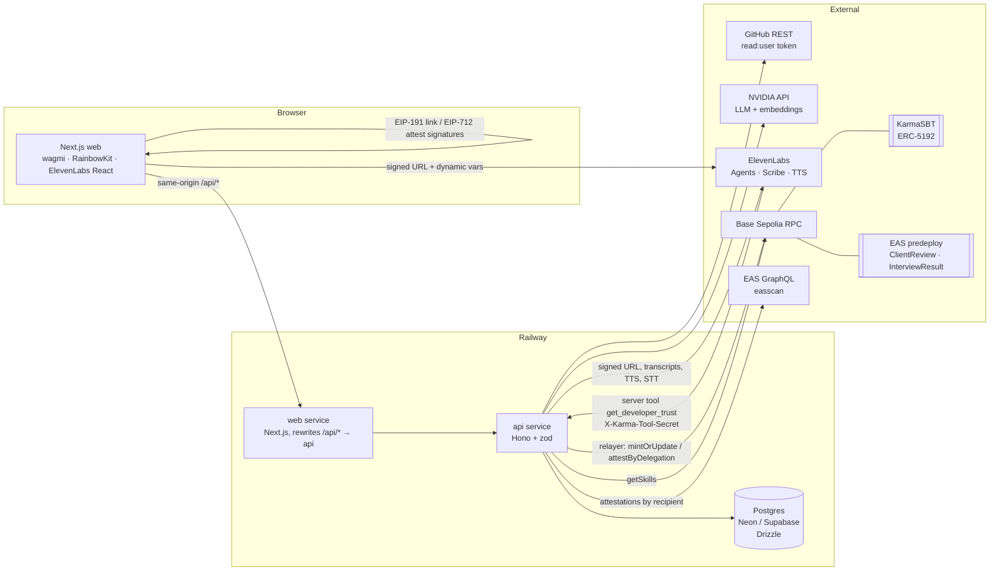
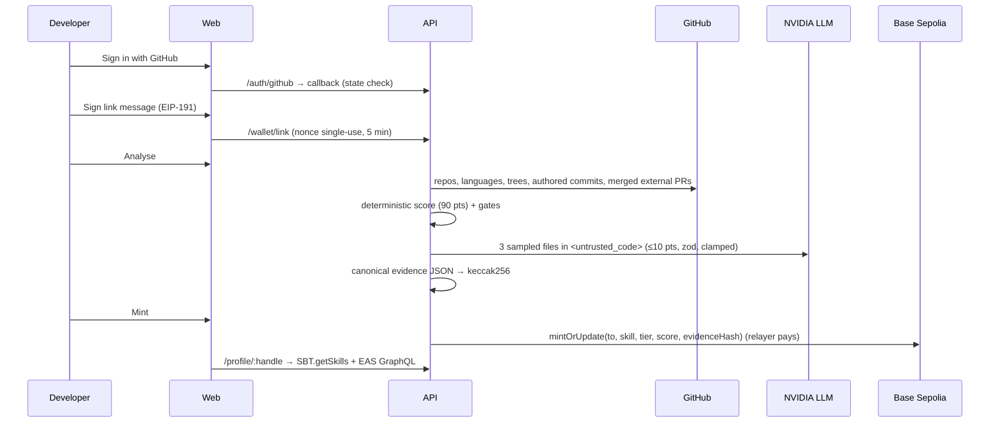

# Architecture

## Pipeline

## Key decisions

- **Scoring is mostly deterministic.** Complexity 25, hygiene 25, authorship 20, external validation 20, and a bounded LLM substance rubric of 10. Prompt injection in code can move a score by 10 points at most, and a test proves it (`apps/api/test/analysis.test.ts`).
- **Evidence is content-addressed.** The evidence JSON is canonicalised (RFC 8785) and hashed with keccak256. The hash is stored in the token; `GET /evidence/:hash` serves the JSON; the profile page rehashes it in the browser.
- **Soulbound, but revocable.** `KarmaSBT` blocks every transfer and approval, allows one token per (owner, skill), lets the minter raise or refresh it, and lets the admin revoke (burn) on fraud. Admin and minter are different keys.
- **Attestations use EAS delegation.** Clients and candidates sign EIP-712 typed data in their own wallet. The relayer submits `attestByDelegation`, so the attester recorded on-chain is the signer, not us. The API rebuilds the attestation data server-side, so a signature can only cover what we submit.
- **Voice is driven by dynamic variables.** One private ElevenLabs agent; the API returns a signed URL plus `question_plan`, `tone`, `interviewer_style`, etc. No per-call overrides.
- **Reports quote the transcript.** Every quote the evaluator returns is checked as a substring of a candidate turn. Unverifiable quotes are dropped, and a criterion without quotes loses its score. No personality, accent or tone scores.
- **Everything degrades.** No DB URL → embedded PGlite. No NVIDIA → template plans, template match reasons, deterministic text interviewer. No ElevenLabs → text interview + browser speech. No chain → profile still shows analyses, labelled not minted.
- **Vectors without pgvector.** Fewer than 200 profiles, so embeddings live in `jsonb` and cosine runs in TypeScript. Keyword similarity is the fallback.

## Services

| Service | Path | Runtime |
|---|---|---|
| web | `apps/web` | Next.js 16 (App Router), Railway |
| api | `apps/api` | Node 22 + Hono, run with `tsx`, Railway |
| contracts | `packages/contracts` | Foundry, Solidity 0.8.28, OZ 5.6 |
| shared | `packages/shared` | zod schemas, rubric, ABI, deployments (TS source, no build step) |

## Security notes

See the checklist in the README. Highlights: secrets only in the API service; httpOnly SameSite=Lax session cookie; OAuth `state`; GitHub token AES-256-GCM at rest and deleted on logout; single-use nonces; zod on every route; per-IP and per-user rate limits; 1 MB default body cap; constant-time tool secret compare; SSRF guard validates DNS before and at connect time; zip parser rejects traversal, symlinks and bombs.
